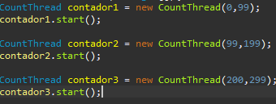
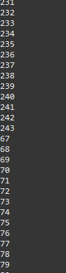
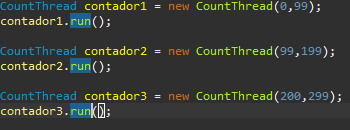
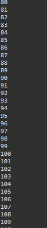

# ARSW Laboratorio 1, 2020-2

# Integrantes: 
- Edwin Yesid Rodriguez Maldonado
- Guillermo Esteban Bernal Bonilla

## Black List Search
### Part I - Introduction to threads in JAVA

1. In agreement with the lectures, complete the classes CountThread, so that they define the life cycle of a thread that prints the numbers between A and B on the screen.

En la siguiente imagen mostramos la clase CountThread completa con un metodo Cycle el cual se encarga de hacer el recorrido en los intervalos a y b dados al inicio

2. Complete the main method of the CountMainThreads class so that: 
2,1. Create 3 threads of type CountThread, assigning the first interval [0..99], the second [99..199], and the third [200..299].
2,2. Start the three threads with start(). Run and check the output on the screen.

En las siguientes imagenes se muestran los intervalos y el funcionamiento del metodo start() en la clase CountThreadsMain.

2,3. Change the beginning with start() to run(). How does the output change? Why?

En las siguientes imagenes se muestran los intervalos y el funcionamiento del metodo Run() en la clase CountThreadsMain.

La diferencia que se encuentra al momento de utilizar el metodo start() y el metodo run() es que al momento de ejecutar el metedo run() se inicia un proceso de manera secuencial por lo que cada hilo se ejecutara uno detras de otro, por otro lado al ejecutar el metodo start() se inicia un proceso en paralelo en el cual los 3 hilos se ejecutaran como ya se habia dicho antes, de manera paralela.

### Part II - Black List Search Exercise 
For an automatic computer security surveillance software, a component is being developed to validate the IP addresses in several thousands of known malicious blacklists (of malicious hosts), and to report those that exist in at least five of said lists.

Said component is designed according to the following diagram, where:

- HostBlackListsDataSourceFacade is a class that offers a facade for queries in any of the N registered blacklists (method 'isInBlacklistServer'), and which also allows a report to a local database of when an IP address is considered dangerous. This class is NOT MODIFIED, but it is known to be 'Thread-Safe'.

- HostBlackListsValidator is a class that offers the checkHost method, which, through the HostBlackListDataSourceFacade class, validates a given host in each of the blacklists. In this method is considered the policy that when a HOST is found in at least five blacklists, it will be registered as not reliable, or as reliable otherwise. Additionally, it will return the list of the numbers of the blacklists where the HOST was registered.

When using the module, the evidence that the registration was made as reliable or not reliable is given by the messages of LOGs:

INFO: HOST 205.24.34.55 Reported as trustworthy (imagen)

INFO: HOST 205.24.34.55 Reported as NOT trustworthy(imagen)

The test program provided (Main), takes only a few seconds to analyze and report the address provided (200.24.34.55), since it is registered more than five times in the first servers, so it does not need to cover all of them. However, doing the search in cases where there are NO reports, or where they are scattered in the thousands of blacklists, takes a lot of time.

This, like any search method, can be seen as a shamefully parallel problem, since there are no dependencies between one part of the problem and another.

To refactor this code, and have it exploit the multi-core capability of the computer's CPU, do the following:

1. Create a Thread class that represents the life cycle of a thread that searches for a segment of the pool of available servers. Add to that class a method that allows you to ask the instances of it (the threads) how many occurrences of malicious servers it has found or found.

Se muestra la clase ThreadSearch implementada.

2. Add to the checkHost method an integer parameter N, corresponding to the number of threads between which the search will be carried out (remember to take into account if N is even or odd!). Modify the code of this method so that it divides the search space between the indicated N parts, and parallels the search through N threads. Have that function wait until the N threads finish solving their respective sub-problem, add the occurrences found for each thread to the list that returns the method, and then calculate (adding the total number of occurrences found for each thread) if the Number of occurrences is greater than or equal to BLACK_LIST_ALARM_COUNT. If this is the case, in the end the host MUST be reported as reliable or not reliable, and the list should be shown with the numbers of the respective blacklists. To achieve this wait behavior, review the join method of the Java concurrency API. Also keep in mind:

Metodo CheckHost modificado

  - Inside the checkHost method the LOG must be kept informing, before returning the result, the number of revised blacklists VS. the number of total blacklists (line 60). It must be guaranteed that said information is true under the new parallel processing scheme proposed.
  
  

  - It is known that HOST 202.24.34.55 is blacklisted in a more dispersed way, and that host 212.24.24.55 is NOT on any blacklist.

### Part III - Discussion

The strategy of parallelism previously implemented is inefficient in certain cases, since the search is still carried out even when the N threads (as a whole) have already found the minimum number of occurrences required to report to the server as malicious. How could the implementation be modified to minimize the number of queries in these cases? What new element would this bring to the problem?

Al momento de quere minimizar la cantidad de consultas por cada caso, el utilizar el parametro BLACK_LIST_ALARM_COUNT como variable comun para todos los threads ayuda a reducir considerablemente estas consultas ya que de esta manera todos los threads seran consientes de cuando se llegue al menor numero de ocurrencias y detendran la realizacion de consultas.

### Part IV - Performance Evaluation

From the above, implement the following sequence of experiments to perform the validation of dispersed IP addresses (for example 202.24.34.55), taking the execution times of them (be sure to do them on the same machine):

1. A single thread.

2. As many threads as processing cores (have the program determine this using the Runtime API). 

3. As many threads as twice the number of processing cores.

4. 50 threads 

5. 100 threads

When starting the program run the monitor jVisualVM, and as you run the tests, review and record the CPU and memory consumption in each case.

With the above, and with the given execution times, make a graph of solution time vs. Number of threads. Analyze and hypothesize with your partner for the following questions (you can take into account what was reported by jVisualVM):

- According to Amdahls law, where S(n) is the theoretical improvement of performance, P the parallel fraction of the algorithm, and n the number of threads, the greater n, the better this improvement should be. Why is the best performance not achieved with the 500 threads? How is this performance compared when using 200 ?.

- How does the solution behave using as many processing threads as cores compared to the result of using twice as much?

- According to the above, if for this problem instead of 100 threads in a single CPU could be used 1 thread in each of 100 hypothetical machines, Amdahls law would apply better ?. If x threads are used instead of 100/x distributed machines (where x is the number of cores of these machines), would it be improved? Explain your answer.

