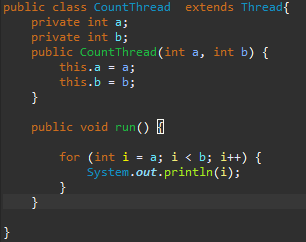
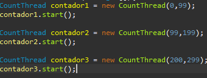
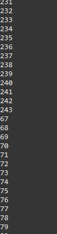
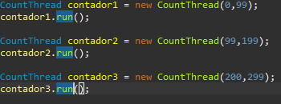
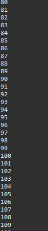

# ARSW Laboratorio 1, 2020-2

# Integrantes: 
- Edwin Yesid Rodriguez Maldonado
- Guillermo Esteban Bernal Bonilla

## Black List Search
### Part I - Introduction to threads in JAVA

1. In agreement with the lectures, complete the classes CountThread, so that they define the life cycle of a thread that prints the numbers between A and B on the screen.

En la siguiente imagen mostramos la clase CountThread completa con un metodo Cycle el cual se encarga de hacer el recorrido en los intervalos a y b dados al inicio

2. Complete the main method of the CountMainThreads class so that: 
2,1. Create 3 threads of type CountThread, assigning the first interval [0..99], the second [99..199], and the third [200..299].
2,2. Start the three threads with start(). Run and check the output on the screen.

En las siguientes imagenes se muestran los intervalos y el funcionamiento del metodo start() en la clase CountThreadsMain.

2,3. Change the beginning with start() to run(). How does the output change? Why?

En las siguientes imagenes se muestran los intervalos y el funcionamiento del metodo Run() en la clase CountThreadsMain.

La diferencia que se encuentra al momento de utilizar el metodo start() y el metodo run()
